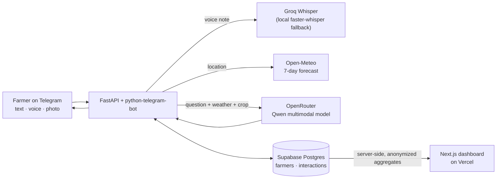

# Gebere (ገበሬ)

**An agronomist in every pocket.** Gebere is an AI farming assistant on Telegram. A farmer asks a question by text, voice note or crop photo, and gets practical advice built around their crop and their local 7-day weather forecast. A companion web dashboard shows live, anonymized usage.

*Gebere (ገበሬ) is Amharic for "farmer".*

| | |
|---|---|
| **Dashboard (live)** | https://geberefarmbot.vercel.app |
| **Telegram bot** | https://t.me/geberefarmbot |

> **About the live bot:** it runs on a free hosting tier that puts it to sleep after 15 minutes without web traffic, and messaging it does not wake it. To wake it, open `https://YOUR-SERVICE.onrender.com/health`, wait about a minute, then message the bot. The screenshots and demo video below show it working end to end.


## What it does

- **Text, voice and photo questions.** Voice notes are transcribed with Whisper; crop photos are analysed by a multimodal model that describes visible symptoms (yellowing, spots, curling, pests) without claiming a definite diagnosis.
- **Weather-aware advice.** The farmer shares a location once, and every answer uses a fresh 7-day forecast from Open-Meteo (temperature, rain, weather codes).
- **Remembers the farm.** Crop and location are stored per farmer, so `/start` greets returning farmers and skips setup, even after a server restart.
- **Friendly commands.** `/help`, `/profile`, `/weather`, `/setcrop`, `/setlocation`, with a one-tap "share location" button.
- **Privacy-first dashboard.** Live counts, a 7/14/30-day activity chart, question-type and crop breakdowns. Names, usernames, Telegram IDs and coordinates are never sent to the browser, and conversation text can be switched off for the public site.

## Architecture



**Request flow for a voice question:** Telegram voice note → download → transcribe (Groq Whisper, falling back to local Whisper if installed) → load the farmer's crop and location from Supabase → fetch the 7-day forecast → prompt the LLM with crop, weather and question → reply on Telegram → store the interaction.

## Tech stack

| Layer | Tools |
|---|---|
| Bot and API | Python, FastAPI, python-telegram-bot, asyncio |
| AI | OpenRouter (free Qwen multimodal model), Whisper (Groq hosted, faster-whisper local) |
| Data | Supabase Postgres with row-level security |
| Weather | Open-Meteo |
| Dashboard | Next.js (App Router), TypeScript, Tailwind CSS, Recharts |
| Hosting | Vercel (dashboard), Render free tier (bot) |

## Design decisions

- **Row-level security stays on.** The backend writes with a secret key; the dashboard reads on the server with a server-only key (never `NEXT_PUBLIC_`). Nothing sensitive is reachable from the browser.
- **Privacy by construction.** The dashboard data layer returns aggregates only and masks long numbers and `@handles` in any text it shows. `HIDE_CONVERSATIONS=true` removes conversation text entirely.
- **Non-blocking bot.** Slow work (transcription, LLM calls, database writes) runs in worker threads and Telegram updates are processed concurrently, so one slow request doesn't freeze everyone else.
- **Swappable transcription.** Hosted Whisper keeps the production image small and fits free-tier memory; local Whisper remains an optional fallback for development.
- **Honest AI behaviour.** The prompts require plain language, no definite disease diagnoses, and English replies unless the AI is confident in another language.

## Project structure

```
crop-advisor/
├── app/main.py             # FastAPI app + Telegram bot + AI/weather/DB logic
├── dashboard/              # Next.js dashboard
│   ├── app/                # page + global styles
│   ├── components/         # interactive dashboard UI
│   └── lib/                # server-only Supabase client + anonymized stats
├── requirements.txt        # production dependencies (Render)
├── requirements-local.txt  # adds local Whisper for development
└── .env.example
```

## Run locally

```powershell
python -m venv .venv
.venv\Scripts\Activate.ps1
pip install -r requirements-local.txt
copy .env.example .env     # then fill in the values
uvicorn app.main:app --reload
```

Dashboard (separate terminal):

```powershell
cd dashboard
npm install
npm run dev
```

Create `dashboard/.env.local` with `SUPABASE_URL` and `SUPABASE_SECRET_KEY`.

### Environment variables

| Variable | Purpose |
|---|---|
| `OPENROUTER_API_KEY` | LLM and photo analysis |
| `TELEGRAM_BOT_TOKEN` | From @BotFather |
| `SUPABASE_URL`, `SUPABASE_SECRET_KEY` | Database (use the secret key, server-side only) |
| `GROQ_API_KEY` | Hosted Whisper transcription (optional if local Whisper is installed) |
| `HIDE_CONVERSATIONS` | Dashboard only: set to `true` to hide conversation text |

### Database

```sql
create table farmers (
  id uuid primary key default gen_random_uuid(),
  telegram_user_id bigint unique not null,
  username text, first_name text, crop text,
  latitude double precision, longitude double precision,
  created_at timestamptz default now(), updated_at timestamptz default now()
);

create table interactions (
  id uuid primary key default gen_random_uuid(),
  farmer_id uuid references farmers(id) on delete cascade,
  interaction_type text not null,
  user_message text, ai_response text,
  created_at timestamptz default now()
);
```

## Deployment

- **Dashboard:** Vercel, with the root directory set to `dashboard` and the environment variables above.
- **Bot:** Render web service. Build: `pip install -r requirements.txt`. Start: `uvicorn app.main:app --host 0.0.0.0 --port $PORT`.

## Known limitations

- **English only.** Amharic and other languages are not reliable yet: speech recognition and the free language model both need an upgrade first.
- **Free-tier hosting.** The bot sleeps when idle (see the note at the top).
- **Polling, not webhooks.** Telegram updates are fetched by polling, which is why the free host can't wake the bot.
- **Advice is guidance, not a diagnosis.** It does not replace a local agricultural extension officer.
- **No automated tests yet.**

## Roadmap

- Telegram webhooks, so the bot can wake on demand and free-tier hours last longer
- Amharic support with a stronger speech and language stack
- Automated tests for the data layer and message handlers
- Per-user rate limiting and abuse protection
- Regional crop calendars and a richer weather-risk summary